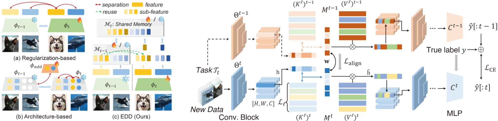

# Expandable and Differentiable Dual Memories with Orthogonal Regularization (EDD)

[](https://arxiv.org/abs/2511.09871)
[](https://arxiv.org/abs/2511.09871)
[](https://opensource.org/licenses/MIT)

> **Official PyTorch Implementation** for the paper:  
> **"Expandable and Differentiable Dual Memories with Orthogonal Regularization for Exemplar-free Continual Learning"** > Accepted to **AAAI 2026**.

[**Hyung-Jun Moon**](https://scholar.google.co.kr/citations?user=VBtt5bEAAAAJ&hl=ko) and [**Sung-Bae Cho**](https://scholar.google.co.kr/citations?user=px5LGgMAAAAJ&hl=ko)  
Yonsei University, Seoul, Korea

---

## 📢 News
* **[2025.12]** 🎉 This paper has been accepted to **AAAI 2026**!
* **[2025.11]** The preprint is available on [arXiv](https://arxiv.org/abs/2511.09871).
* **[2025.11]** Code release.

---

## 📖 Abstract

<p align="center">
  
</p>

Continual learning (CL) aims to learn a sequence of tasks while maintaining performance on previous tasks, but catastrophic forgetting remains a fundamental challenge. To address this, we propose a novel **Expandable and Differentiable Dual Memory (EDD)** method. 

**Key Features:**
- **Dual Memory Architecture**: Composed of a *Shared Memory* ($M^s$) for common features and a *Task-specific Memory* ($M^t$) for discriminative characteristics.
- **Fully Differentiable**: Enables end-to-end learning of latent representations without external buffers.
- **Orthogonal Regularization**: Enforces geometric separation between preserved and newly learned memory components to prevent interference.
- **Performance**: Outperforms 14 state-of-the-art methods on CIFAR-10, CIFAR-100, and Tiny-ImageNet benchmarks.

---

## 🛠️ Installation

This code is built on top of the [Mammoth](https://github.com/aimagelab/mammoth) framework (A PyTorch Framework for Benchmarking Continual Learning).

### Prerequisites
* Python 3.8+
* PyTorch
* Mammoth dependencies

### Setup
```bash
# Clone this repository
git clone [https://github.com/axtabio/EDD.git](https://github.com/axtabio/EDD.git)
cd EDD

# Install dependencies (Example)
pip install -r requirements.txt

# Train EDD on the Sequential CIFAR-10 dataset:
python main.py --model EDD --dataset seq-cifar10 \
    --backbone edd --embedDim 1000 \
    --lambda_memory 20.0 --lambda_orthogonal 10.0 --memory_pruning_ratio 0.15 \
    --ba_lr 0.0001 --ba_epochs 20 --lr 0.001

```
### 📝 Citation

```bibtex
@inproceedings{moon2026edd,
  title={Expandable and Differentiable Dual Memories with Orthogonal Regularization for Exemplar-free Continual Learning},
  author={Moon, Hyung-Jun and Cho, Sung-Bae},
  booktitle={Proceedings of the AAAI Conference on Artificial Intelligence (AAAI)},
  year={2026}
}
```

### 🙏 Acknowledgements
This repository is based on Mammoth. We thank the authors for their excellent framework.

### 📧 Contact
If you have any questions, please feel free to contact us via email:

Hyung-Jun Moon: axtabio@yonsei.ac.kr


